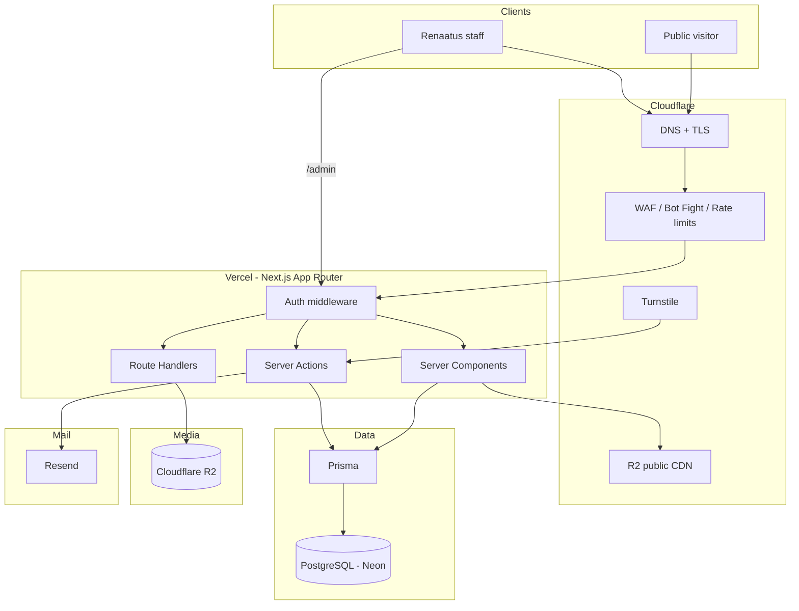
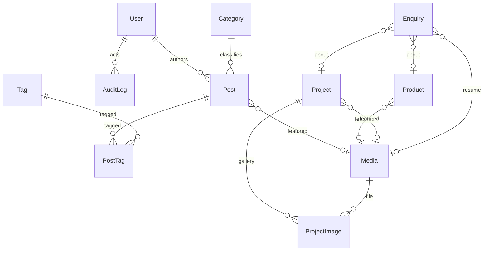
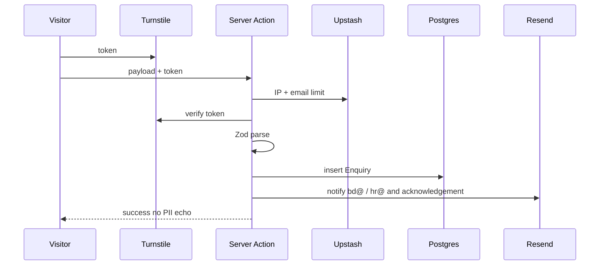
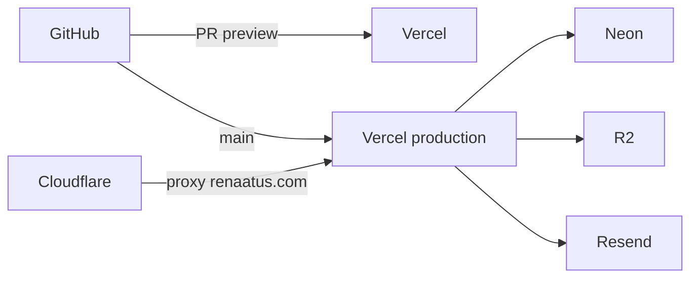

# Renaatus production architecture

**Status:** Production foundation is in `website/` (tooling, Prisma, env, logging, validation). Marketing pages from the prototype remain; CMS/admin are not implemented yet.  
**Reference:** [skyi.com](https://skyi.com/) for pacing, cinematic media, and editorial restraint — not branding, copy, or code.  
**Positioning:** Renaatus is a manufacturer-builder (EPC + luxury realty + Renacon AAC) across India, Maldives, and Mauritius. The site must feel more material, international, and civic than a single-city residential brand.

Related: [asset inspection](../asset-inspection/REPORT.md).

---

## Design principles

1. **Content-justified IA** — every public route maps to existing Renaatus work, leadership, or legal need. No invented business lines.
2. **Git stays small** — media lives in Cloudflare R2; Postgres holds records; Excel is export-only.
3. **Database is source of truth** for enquiries, careers, and journal. Marketing projects/products are CMS-managed so the site does not depend on hardcoded `content.ts` in production.
4. **Admin is a thin internal CMS**, not a second public site.
5. **Premium original UX** — dark mineral palette, slow cinematic motion, typography-led heroes, project-first storytelling. Do not reproduce SKYI’s product labels, Pune township cards, or “Thoughtfully Designed™” pattern.

---

## Architecture diagram



**Request path:** Visitor → Cloudflare (DNS, TLS, WAF) → Vercel → Server Components / Actions → Prisma → Neon. Media URLs point at R2. Form posts never write Excel first.

---

## Stack

| Layer | Choice | Reason |
| --- | --- | --- |
| App | Next.js 16 App Router, TypeScript, Tailwind v4 | Already in `website/` |
| UI | shadcn/ui + Framer Motion | Admin density + premium motion on marketing |
| Validation | Zod in Server Actions and Route Handlers | Single schema, shared with Prisma where possible |
| ORM / DB | Prisma + PostgreSQL on **Neon** | Native Vercel, branching for previews |
| Auth | Auth.js v5 (NextAuth) + Prisma adapter + Argon2id | Server-side sessions, no public consumer accounts |
| Email | **Resend** | Transactional receipts + admin alerts |
| Media | **Cloudflare R2** + optional Images resizing | Same vendor as DNS; no 5 GB in Git |
| Cache / rate limit | Cloudflare rules + **Upstash Redis** | Serverless-safe rate limits |
| Bots | Cloudflare Turnstile | Privacy-friendly CAPTCHA |
| Hosting | Vercel | App + cron + preview deploys |
| Edge / DNS | Cloudflare proxy in front of Vercel | WAF, headers, DDoS |
| Repo | GitHub | Already `PrathickPriyak/renaatus` |
| Spreadsheets | Excel **export** from admin | Never the system of record |

---

## Sitemap (justified)

Primary nav stays short. Secondary items live in footer / About cluster.

| Route | Justification | Notes |
| --- | --- | --- |
| `/` | Group hero, stats, three verticals | Cinematic; not a SKYI township grid clone |
| `/about` | Vision, mission, leadership, timeline | Only named leaders with bios until others are confirmed |
| `/why-renaatus` | Existing pillars: manufacturer + builder, footprint | Distinct from About story |
| `/projects` | Realty + infrastructure portfolios | Filter: type, country, industry |
| `/projects/[slug]` | Galleries already exist in the seed library | |
| `/products` | Renacon AAC — photos + public copy exist | Do not invent a full SKU catalogue yet |
| `/products/[slug]` | Start with `renacon-aac-blocks` only | More SKUs when the 5 GB pack is classified |
| `/services` | EPC / design-build / materials — current vertical copy | Three services, not a consultancy fiction |
| `/industries` | Derived from **delivered work** | Aviation, healthcare, water, transport, civic, residential |
| `/journal` | CMRL + SAP stories exist | “Journal” not “Blog” in the UI; `/blog` redirects |
| `/journal/[slug]` | CMS posts | |
| `/contact` | Offices + enquiry | |
| `/careers` | Existing careers page + applications | |
| `/privacy` `/terms` `/cookies` | Production legal | Static MDX, legal review required |
| `not-found` | 404 | |

**Not in sitemap (unjustified today):** shop, investor relations, franchise, pricing calculator, SKYI-style sub-brands (Five/Iris/Aria).

**Redirects from the prototype:** `/realty` → `/projects?type=realty`, `/infrastructure` → `/projects?type=infrastructure`, `/blog` → `/journal`.

### Industries (from actual projects)

- Aviation — Rajahmundry, GAN Airport  
- Healthcare & campuses — JIPMER, Tiruppur Medical College, IGMH, NIT-E  
- Water & irrigation — GA Canal, Rajavaikal, Mettur  
- Transport — SH-95, Perungalathur, Pollachi–Podanur ROB  
- Civic & justice — Supreme Court of Mauritius  
- Residential — Maldives realty, social housing, Vilankurichi  

---

## Folder structure

Evolve `website/`; do not start a second app.

```
website/
├── prisma/
│   ├── schema.prisma
│   └── migrations/
├── src/
│   ├── app/
│   │   ├── (marketing)/          # public layouts
│   │   ├── admin/                # protected
│   │   ├── api/
│   │   │   ├── auth/[...nextauth]/
│   │   │   ├── uploads/          # presigned R2
│   │   │   └── cron/             # optional
│   │   ├── robots.ts
│   │   └── sitemap.ts
│   ├── components/
│   │   ├── ui/                   # shadcn
│   │   ├── marketing/
│   │   └── admin/
│   ├── lib/
│   │   ├── db.ts                 # Prisma singleton
│   │   ├── auth.ts
│   │   ├── r2.ts
│   │   ├── mail.ts
│   │   ├── rate-limit.ts
│   │   └── validations/
│   ├── server/
│   │   ├── actions/              # mutations
│   │   └── queries/              # cached reads
│   └── emails/                   # Resend templates
├── content/legal/                # MDX
└── public/                       # favicon + tiny logos only
```

Repo root keeps `assets/` as a **staging drop** for the seed library, not the production CDN. `scripts/sync-assets.sh` must not copy documents into `public/` in production.

---

## Route structure

### Public (Server Components by default)

| Method | Path | Data |
| --- | --- | --- |
| GET | `/` | Featured projects, product teaser, latest journal |
| GET | `/about` | Leadership, timeline |
| GET | `/why-renaatus` | Pillars |
| GET | `/projects` | Prisma `Project` + filters |
| GET | `/projects/[slug]` | Project + media |
| GET | `/products` | Published products |
| GET | `/products/[slug]` | Product + enquiry CTA |
| GET | `/services` | Static sections + links to projects |
| GET | `/industries` | Aggregated from `Project.industry` |
| GET | `/industries/[slug]` | Filtered projects |
| GET | `/journal` | Published posts |
| GET | `/journal/[slug]` | Post body |
| GET | `/contact` `/careers` | Forms |
| GET | `/privacy` `/terms` `/cookies` | MDX |

Client islands: motion, filters, forms, video player.

### Admin (server-protected)

| Path | Role |
| --- | --- |
| `/admin` | Any staff — counts |
| `/admin/enquiries` | VIEWER+ |
| `/admin/enquiries/[id]` | VIEWER+ |
| `/admin/journal` | EDITOR+ |
| `/admin/journal/[id]` | EDITOR+ |
| `/admin/media` | EDITOR+ |
| `/admin/projects` | EDITOR+ (needed to ship the sitemap) |
| `/admin/products` | EDITOR+ |
| `/login` | Public, rate-limited |

### Route handlers

| Path | Purpose |
| --- | --- |
| `GET/POST /api/auth/*` | Auth.js |
| `POST /api/uploads` | Auth’d presigned R2 PUT |
| `GET /admin/enquiries/export` | XLSX download (cookie session) |
| `POST /api/webhooks/resend` | Optional delivery events |

Public forms use **Server Actions**, not public REST.

---

## Database model plan

**One enquiry table** (kinds: contact, product, career, project) instead of three near-identical tables.  
**Roles as enum** on `User`, not a Role table (three roles, no custom ACL).  
**Auth.js adapter tables** (`Account`, `Session`, `VerificationToken`) are required for sessions.  
**Project / Product** are included because the sitemap cannot be production-CMS without them.  
Legal pages stay MDX.

Proposed Prisma file: [`schema.prisma`](./schema.prisma).

### Entity map



### Enquiry kinds and fields

| Kind | Extra fields |
| --- | --- |
| `CONTACT` | office region, subject |
| `PRODUCT` | `productId` |
| `PROJECT` | `projectId` (realty tour / infra bid) |
| `CAREER` | `resumeMediaId` (private object) |

Status: `NEW` → `IN_PROGRESS` → `CLOSED`. Excel is generated from this table.

### Post workflow

`DRAFT` → `PUBLISHED` → `UNPUBLISHED` or `ARCHIVED`.  
Slug unique. SEO: `seoTitle`, `seoDescription`, `ogImageId`. Body: JSON (TipTap/Portable-style) stored as `Json`. Featured image → `Media`. Author → `User`.

---

## API plan

Prefer Server Actions with Zod. Route Handlers only for auth, binary upload, and Excel.

| Action | Input (Zod) | Side effects |
| --- | --- | --- |
| `submitContact` | name, email, phone?, message, office, Turnstile | Insert `Enquiry`, email staff + visitor |
| `submitProductEnquiry` | + productId | Same |
| `submitCareer` | + resume key | Private R2 object, virus-scan later |
| `createPost` / `updatePost` / `setPostStatus` | EDITOR | Audit log |
| `updateEnquiryStatus` | VIEWER+ | Audit log |
| `createMediaRecord` | after R2 PUT | |

All actions: `auth()` where needed, Turnstile on public, rate limit by IP + email.

---

## Authentication plan

- **No public user accounts.**
- Auth.js v5, Prisma adapter, **database sessions** (not JWT-only) so sessions can be revoked.
- Passwords: Argon2id. Invite-only first admin via `scripts/create-admin.ts` (run locally, never committed secrets).
- Optional later: magic link via Resend.
- `middleware.ts` matches `/admin/:path*` and `/api/uploads`.
- **Every admin layout** also calls `auth()` (middleware is not the only gate).
- Roles:
  - `SUPER_ADMIN` — users, exports, everything
  - `EDITOR` — journal, media, projects, products
  - `VIEWER` — enquiries read + status

Lockout: 5 failures / 15 min per IP (Upstash). Idle session 8 hours.

---

## Admin plan

Internal UI (shadcn), not the marketing visual language.

1. **Dashboard** — new enquiries, draft posts, storage usage.  
2. **Enquiries** — filters by kind/status/date; detail pane; **Export Excel**.  
3. **Journal** — list, editor (TipTap), status machine, schedule `publishedAt`.  
4. **Media** — grid, public vs private, never list private resume URLs as hotlinks without auth.  
5. **Projects / Products** — sufficient to replace `content.ts`.

No public `/admin` link in the marketing footer.

---

## Blog / Journal plan

- Public name: **Journal**.  
- CMS fields: title, slug, excerpt, body JSON, category, tags, featured media, author, status, SEO.  
- Preview: `/admin/journal/[id]/preview` (auth’d) using draft body.  
- ISR: `revalidateTag('journal')` on publish.  
- Seed: CMRL Central Tower, SAP go-live.  
- Do not scrape or invent news.

---

## Form plan



- Database write is mandatory and happens **before** email. Email failure is logged; the enquiry still exists.  
- Excel: `GET /admin/enquiries/export?kind=&from=&to=` → `.xlsx`.  
- Careers: resume PDF/DOCX, max 5 MB, private R2 prefix `private/careers/`.  
- Honeypot field + Turnstile (defence in depth).

---

## Security plan

| Control | Implementation |
| --- | --- |
| Input validation | Zod on every Action/Handler; Prisma typed writes |
| Rate limiting | Cloudflare + Upstash (forms 5/10min/IP; login 5/15min) |
| Bots | Turnstile + Cloudflare Bot Fight |
| XSS | React escaping; TipTap sanitise on save (allowlist tags); no `dangerouslySetInnerHTML` except sanitised journal HTML |
| CSRF | Server Actions (Next origin check) + SameSite=Lax session cookie |
| AuthZ | Role checks in actions, not only UI |
| Uploads | Presigned PUT, MIME allowlist, size caps, random keys, private default for resumes |
| Headers | `X-Frame-Options`, `Referrer-Policy`, `Permissions-Policy`, `X-Content-Type-Options` via next.config + Cloudflare |
| CSP | Strict enough for Next + Turnstile + Vercel; nonce for scripts |
| Env | Vercel + Cloudflare secrets; never in Git; `DATABASE_URL` pooled |
| DB | Least-privilege Neon role; no public exposure; backups |
| Errors | Generic client messages; `AuditLog` + Vercel logs for stack |
| Audit | Who, action, entity, IP, timestamp |
| Dependencies | `npm audit` in CI; Dependabot |
| Media | Private objects require signed URLs; no directory listing |

Do not execute files from the 5 GB pack. Do not put `.env`, credentials, or private PDFs in `public/`.

---

## Deployment plan



1. **GitHub** — this repo; `main` protected; PRs required.  
2. **Vercel** — root directory `website/`; preview deploys per PR; `npm run build:vercel` runs `prisma migrate deploy` on each Vercel build. Full checklist: [`docs/vercel-production.md`](../vercel-production.md) (do not change DNS until that checklist is complete).  
3. **Neon** — prod + preview branches (`website/vercel.json` / Neon integration).  
4. **Cloudflare** — orange-cloud proxy to Vercel; TLS; WAF; R2 bucket `renaatus-web` (public images) + `renaatus-private` (resumes).  
5. **DNS** — `www` + apex on Cloudflare (**not** in the Vercel prep phase).  
6. **Cron** — optional Vercel cron to close stale drafts; not required at launch.  
7. **Observability** — Vercel Analytics + Resend dashboard + Neon insights.  
8. **Go-live checklist** — legal MDX reviewed, Turnstile keys, first SUPER_ADMIN, seed projects/products from current `content.ts`, hero video on R2, disable blanket `sync-assets.sh` in production.

### Environment (names only)

`DATABASE_URL`, `AUTH_SECRET`, `AUTH_URL`, `RESEND_API_KEY`, `R2_ACCOUNT_ID`, `R2_ACCESS_KEY_ID`, `R2_SECRET_ACCESS_KEY`, `R2_BUCKET_PUBLIC`, `R2_BUCKET_PRIVATE`, `R2_PUBLIC_BASE_URL`, `TURNSTILE_SECRET_KEY`, `UPSTASH_REDIS_REST_URL`, `UPSTASH_REDIS_REST_TOKEN`, `ENQUIRY_NOTIFY_EMAIL`.

---

## Premium UX direction (not SKYI)

| SKYI pattern | Renaatus original |
| --- | --- |
| Light, residential, Pune townships | Dark mineral, civic + island luxury |
| Sub-brands (Five, Iris, Aria) | Three group verticals only |
| Price-led development cards | Project cards: place, year, role — no invented pricing |
| “Experience living” amenities | Manufacturer-builder narrative + material close-ups (AAC, concrete, water, air) |
| Recognition logo row | Use only real certifications when assets exist |

Motion: Framer Motion for reveal and page transitions; hero video stays CSS/native for performance. shadcn for admin and form controls, not for the marketing chrome.

---

## Implementation sequence (next phases — not this one)

1. Prisma + Neon + Auth.js + `/admin` shell.  
2. Enquiry actions + Resend + Excel export.  
3. R2 uploads + Media.  
4. Journal CMS.  
5. Migrate projects/products from `content.ts`.  
6. Rebuild marketing routes to this sitemap.  
7. Cloudflare + headers + Turnstile.

**This document does not implement those steps.**
